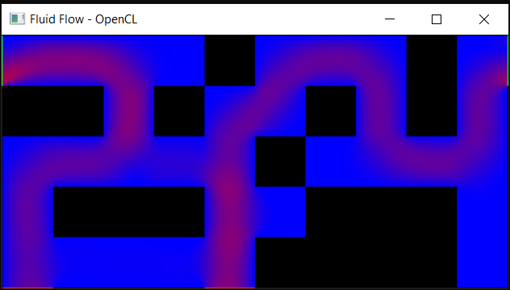

# Parallel Fluid Flow Simulation (Lattice-Boltzmann Method, OpenCL)

Exam project for the **Parallel Programming** course, Faculty of Technical Sciences, Novi Sad (2025) - a 2D fluid flow simulator based on the **Lattice-Boltzmann Method (LBM)**, implemented first as a serial C++ program and then parallelized on the GPU with **OpenCL**, with live visualization through OpenCV.



## Contents

- [Overview](#overview)
- [The physics: Lattice-Boltzmann Method](#the-physics-lattice-boltzmann-method)
- [Domain and boundary conditions](#domain-and-boundary-conditions)
- [Serial implementation](#serial-implementation)
- [Parallel implementation (OpenCL)](#parallel-implementation-opencl)
- [Visualization](#visualization)
- [Benchmark results](#benchmark-results)
- [Project structure](#project-structure)
- [Building and running](#building-and-running)
- [Known limitations](#known-limitations)
- [Author](#author)

## Overview

The project simulates fluid (air) flowing through a 2D domain containing walls, an inlet, and an outlet - the kind of problem behind modeling airflow in rooms, ducts, or ventilation systems. Rather than solving the Navier-Stokes equations directly, it uses the **Lattice-Boltzmann Method**: a mesoscopic approach that tracks the statistical distribution of "packets" of fluid moving between grid nodes along a small set of discrete directions, and derives macroscopic quantities (density, velocity) from that distribution.

The same simulation core (`LBMsys`) is run two ways so the two versions can be compared directly:
- **`serial.cpp`** - a straightforward single-threaded CPU loop
- **`parallel.cpp`** - the same algorithm expressed as five OpenCL kernels, one GPU work-item per grid node

The full write-up (background, design decisions, benchmark analysis) is included as [`Izvestaj.pdf`](Izvestaj.pdf) (in Serbian).

## The physics: Lattice-Boltzmann Method

Fluid dynamics can be modeled at different scales: individual molecules (Newtonian mechanics), full continuum (Navier-Stokes/CFD), or - in between - as statistics over small "boxes" of fluid, which is what LBM does via a discretized Boltzmann equation.

This project uses the standard **D2Q9** lattice: each 2D grid node holds 9 discrete populations `f_i`, one per direction (the 8 compass directions plus "staying in place"), each with its own lattice velocity vector `c_i` and weight `w_i` (`4/9` for the rest particle, `1/9` for the 4 axis-aligned directions, `1/36` for the 4 diagonals) - see `LBMparams` in `LBMsys.h`.

Every simulation step performs the classic LBM sequence:

1. **Streaming** - each population `f_i` moves one lattice step in its direction `c_i` toward the neighboring node. Implemented with **double buffering** (`f` / `f_new`) so every node reads only already-settled values from the previous step, avoiding race conditions - this is exactly what makes the algorithm embarrassingly parallel.
2. **Boundary conditions** - inlet/outlet nodes get their populations recomputed directly from prescribed macroscopic velocity/density rather than from streaming (see below).
3. **Bounce-back** - populations that would stream into a solid (wall) node are instead reflected back the way they came, which enforces a no-slip condition at walls without needing to resolve the wall's internal geometry.
4. **Compute macroscopic quantities** - local density `rho` and velocity `(ux, uy)` are the zeroth and first moments of the 9 populations at each node (`rho = sum(f_i)`, `u = sum(f_i * c_i) / rho`).
5. **Collision (BGK approximation)** - each population relaxes toward its local **equilibrium distribution** `f_eq_i`, a function of `rho`, `u`, and the direction weights:

   ```
   f_eq_i = w_i * rho * (1 + 3(c_i·u) + 4.5(c_i·u)^2 - 1.5|u|^2)
   f_i_new = (1 - omega) * f_i + omega * f_eq_i
   ```

   `omega` is the relaxation rate (tied to the fluid's viscosity) - closer to 1 relaxes faster toward equilibrium.

Because every one of these steps is computed purely from a node's own value and its immediate neighbors, the whole grid can be updated in parallel with no global synchronization *within* a step - only a barrier *between* steps is required, which maps directly onto one OpenCL kernel per step plus a `clFinish` between them.

## Domain and boundary conditions

The domain is described by a plain-text grid where each cell is one of four flags (`config.txt`):

```
0 = fluid   1 = solid/wall   2 = inlet   3 = outlet
```

- **`loadConfig`** parses this grid into the `flags` array and infers the grid dimensions from it.
- **`refineConfig(k)`** upsamples the whole grid by a factor `k`, turning each interior cell into a `k x k` block (edge cells stay 1 cell thick) - this is how a small, easy-to-hand-author maze like the one in `config.txt` becomes a much finer simulation grid (tens of thousands of nodes) without redrawing it by hand.
- **Inlets** are given a fixed macroscopic velocity, shaped by a parabolic profile across the opening (`height_factor`/`width_factor` in `boundaryConditions`) so the flow resembles realistic pipe/duct flow (fastest in the middle, slower near the edges) rather than a uniform slab of velocity.
- **Outlets** copy the velocity from the upstream fluid node just inside the domain (damped by `0.9` and clamped to `±0.3`), which acts as a simple non-reflective outflow condition.
- **Walls** use the bounce-back rule described above.

## Serial implementation

`LBMsys` (`LBMsys.h`/`.cpp`) holds the full simulation state in **SoA (Structure-of-Arrays)** layout for cache-friendlier access:

- `flags` - one byte per node (fluid/solid/inlet/outlet)
- `f`, `f_new` - `9 * N` floats each (all 9 populations for all `N` nodes), current and next step
- `rho_vec`, `ux_vec`, `uy_vec` - macroscopic fields, one float per node

`LBMsys::step(...)` runs the five sub-steps above in sequence (`stream → boundaryConditions → applyBounceBack → computeMacrosFrom → collide`) and `serial(STEPS, REFINE)` just calls it in a loop, refreshing the OpenCV preview every 50 steps.

## Parallel implementation (OpenCL)

`parallel(STEPS, REFINE)` reuses `LBMsys` only to load the config, refine the grid, and produce the initial state - everything after that runs on the GPU:

- **Buffers**: `f_buf`/`f_new_buf` (double-buffered populations), `rho_buf`/`ux_buf`/`uy_buf` (macroscopic fields), `flags_buf` (read-only node types).
- **Kernels** (`.cl` files, one per LBM sub-step, each launched over a 2D `NX x NY` `NDRange` with one work-item per node):
  - `stream_kernel.cl` - streaming
  - `boundaryConditions_kernel.cl` - inlet/outlet handling
  - `bounceBack_kernel.cl` - wall reflection
  - `computeMacros_kernel.cl` - density/velocity moments
  - `collide_kernel.cl` - BGK relaxation
- **Main loop**: for each of `STEPS` iterations, the five kernels are enqueued in order (stream → boundary conditions → bounce-back → compute macros → collide) with `clSetKernelArg`/`clEnqueueNDRangeKernel`, followed by `clFinish` to guarantee the whole grid finishes the current step before the next one starts.
- Every 50 steps, `ux_buf`/`uy_buf` are read back to the host and rendered, same as the serial version.

Since every work-item only ever touches its own node's data (reading neighbors only through the input buffer, never writing to them), there's no contention between work-items within a kernel - the double buffering handles the only cross-node dependency (streaming).

## Visualization

Both versions render the current state through OpenCV every 50 steps, mapping each grid node to one pixel:

- **Wall** → black
- **Inlet** → green
- **Outlet** → red
- **Fluid** → blue-to-red gradient based on local speed `sqrt(ux^2 + uy^2)` (slow = blue, fast = magenta/red) - this is what produces the "hot streaks" through the maze in the screenshot above, showing where the flow has found its fastest path.

Reading the velocity buffers back from the GPU is relatively expensive, which is why it's only done every 50th step rather than every step.

## Benchmark results

From the report, comparing serial vs. OpenCL execution time for 20,000 steps at increasing grid resolutions (via `REFINE`):

| Base grid | Refine factor (node count) | Steps | Serial | Parallel (OpenCL) |
|---|---|---|---|---|
| 7x5 | 50 (38,304 nodes) | 20,000 | 18.7s | 13s |
| 16x7 | 50 (176,904 nodes) | 20,000 | 87s | 21s |

The speedup grows with grid size, as expected: at ~38K nodes the GPU is only modestly faster, but at ~177K nodes it's roughly **4x faster** than the serial CPU version, since a larger grid gives the GPU more independent work-items to parallelize over.

The report's conclusion also notes an important nuance: the serial version is 100% deterministic (fixed execution order), while the GPU version, despite double buffering eliminating race conditions, is not bit-for-bit deterministic between runs - floating-point addition isn't associative, and thousands of work-items completing in a different order each run means tiny rounding differences that compound over many iterations. The *qualitative* result (flow patterns, vortex formation, dead zones) matches between the two, but not bit-for-bit, and not necessarily in the same number of steps.

## Project structure

```
projekat/
├── main.cpp                       # Entry point - runs the parallel (and optionally serial) simulation, times it
├── LBMsys.h / LBMsys.cpp           # Core LBM data + serial step-by-step logic (shared basis for both versions)
├── serial.h / serial.cpp          # Serial CPU simulation loop + OpenCV preview
├── parallel.h / parallel.cpp      # OpenCL setup, buffers, kernel dispatch loop + OpenCV preview
├── stream_kernel.cl                # Streaming step
├── collide_kernel.cl               # BGK collision step
├── computeMacros_kernel.cl         # Density/velocity moment computation
├── bounceBack_kernel.cl            # Wall bounce-back boundary condition
├── boundaryConditions_kernel.cl    # Inlet/outlet boundary condition
├── config.txt / config1.txt        # Example domain layouts (fluid/wall/inlet/outlet grids)
└── projekat.vcxproj                # Visual Studio 2022 project file
Izvestaj.pdf                        # Full written report (background, design, benchmarks, conclusion) - in Serbian
```

## Building and running

This is a **Windows / Visual Studio 2022** project (`PlatformToolset v143`) with two external dependencies configured directly in `projekat.vcxproj`:

- **OpenCV 4.12** (`opencv_world4120.lib`) - expected at `C:\Program Files\opencv\build\...`
- **OpenCL** (`OpenCL.lib`) - headers resolved via an Intel oneAPI 2025.2 install in the current project settings

To build on a different machine, install OpenCV and an OpenCL SDK/ICD for your GPU (Intel oneAPI, NVIDIA CUDA Toolkit, or AMD's OpenCL SDK all provide `CL/cl.h` + `OpenCL.lib`), then update the `IncludePath`/`LibraryPath`/`AdditionalDependencies` entries in `projekat.vcxproj` (or the project's Property Pages) to point at your own install locations. The `.cl` kernel files are loaded and compiled at runtime from the working directory, so the compiled `.exe` needs to run from `projekat/` (where `config.txt` and the `.cl` files live).

`STEPS` and `REFINE` are set at the top of `main.cpp`; `main.cpp` currently runs the parallel version only (the serial call is commented out) so both can be timed independently.

## Known limitations

(from the report's own conclusion)

- Config parsing has minimal error handling/robustness for malformed input.
- Only two boundary condition types are implemented (bounce-back walls, prescribed-velocity inlet/simple outflow outlet) - more realistic conditions (e.g. pressure boundary conditions) aren't covered.
- Only density and velocity are tracked as macroscopic quantities.
- The model is 2D (D2Q9); a 3D lattice (e.g. D3Q19) would allow modeling real 3D domains at the cost of significantly more memory and compute per node.
- GPU results are only reproducible in the qualitative sense (see [Benchmark results](#benchmark-results)) - not bit-for-bit identical to the serial version or between separate GPU runs.

## Author

Stefan Ilić
- Project made as part of the Parallel programming course (4th semester, 2025).
